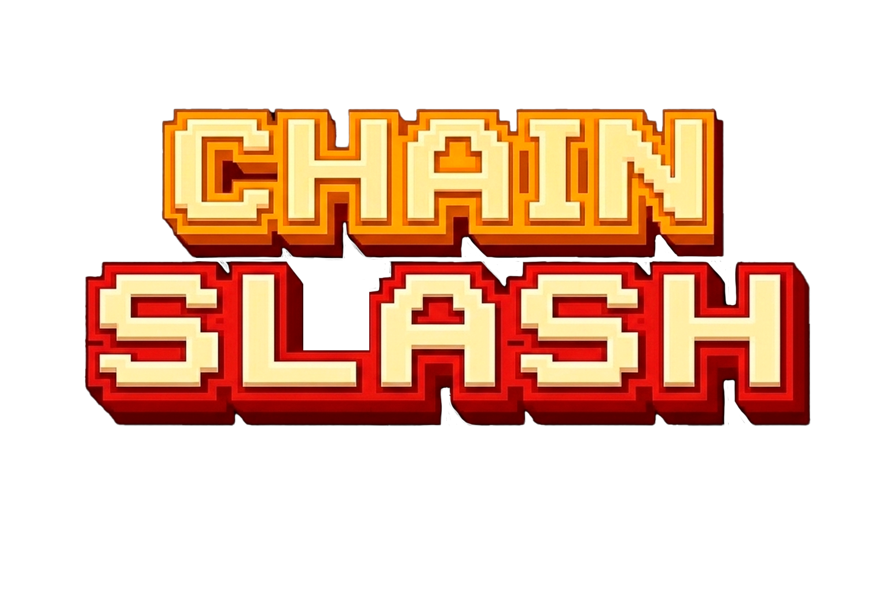
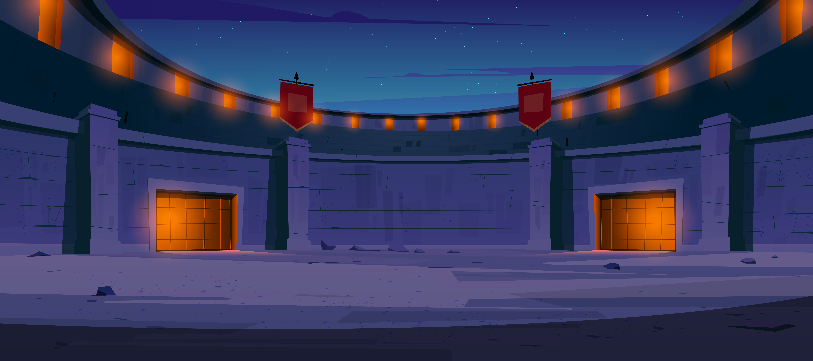

  

  <b>A High-Stakes, On-Chain Creature Battler built for Base.</b> 
  <i>Ship profitable apps in days with 100ms block times and seamless UX.</i>

  
  
  

---

## ⚔️ Project Overview

**CHAIN CLASH** is a fully on-chain, tactical creature battle game that leverages the power of **Base** to deliver a high-performance web2-like gaming experience. Players mint unique elemental brawlers, train them against AI in the arena, and challenge rivals in wager-backed PvP duels.

By utilizing **Move VM** for game logic and **Independant Appchain Deployment**, we've built a scalable gaming economy where every move matters.

  

---

## 🚀 Base-Native Features

This project was built from the ground up to showcase the unique capabilities of the Base ecosystem:

> [!IMPORTANT]
> ### ⚡ Auto-Signing (Session UX)
> Traditional blockchain games are plagued by constant wallet popups. CHAIN CLASH implements **Session Keys**. Once you enter the battle arena, you approve a session once. Every subsequent "Attack", "Defend" or "Special" move is signed automatically in the background. **Zero popups. 100% immersive combat.**

> [!TIP]
> ### 🏷️ Base Usernames (.base)
> Instead of searching for complex 0x addresses, players can find opponents using human-readable names (e.g., `danii.base`) and resolve them to wallet addresses for on-chain challenges.

> [!NOTE]
> ### 🔗 Independent Appchain (Rollup)
> The entire game economy is being migrated to Base-compatible infrastructure for fast finality and broader EVM wallet compatibility.

---

## 🎮 Game Features

### 1. The Elemental Stable
Collect and manage up to 6 brawlers. Each creature belongs to one of 5 elemental classes with a rock-paper-scissors advantage system:
- 🔥 **Pyra (Fire)**: High Attack, weak against Water.
- 💧 **Vyra (Water/Wind)**: High Speed and Versatility.
- 🌑 **Nox (Earth/Shadow)**: High Defense and Special Power.

  
  
  

### 2. Strategic Combat
A deep, turn-based battle engine executed entirely on-chain:
- **Attack**: Standard damage based on `Attack` stat.
- **Heavy Attack**: High risk, high reward damage.
- **Defend**: Negate damage and potentially counter-attack on the next turn.
- **Special**: Use `Elemental Power` for devastating status-altering moves.

### 3. Wager-Backed PvP
Challenge other players to 1v1 duels. Both players escrow **ETH** into the battle contract; the winner takes the entire prize pool (minus a small house fee for the DAO).

### 4. 8-Player Tournaments
Host or join weekly tournaments. 8 players compete in a single-elimination bracket for the ultimate title of **Arena Champion**.

---

## 🛠️ Technical Stack

- **L1/L2 Infrastructure**: [Base](https://docs.base.org)
- **Smart Contracts**: EVM contracts
- **Frontend**: React 19, TypeScript, Vite, Tailwind CSS
- **Wallet Connection**: EVM-compatible wallets (Base network)
- **Animations**: HTML5 Canvas with custom pixel-art engine

### Architecture Diagram

  

---

  Built with ❤️ for CHAIN CLASH on Base.

